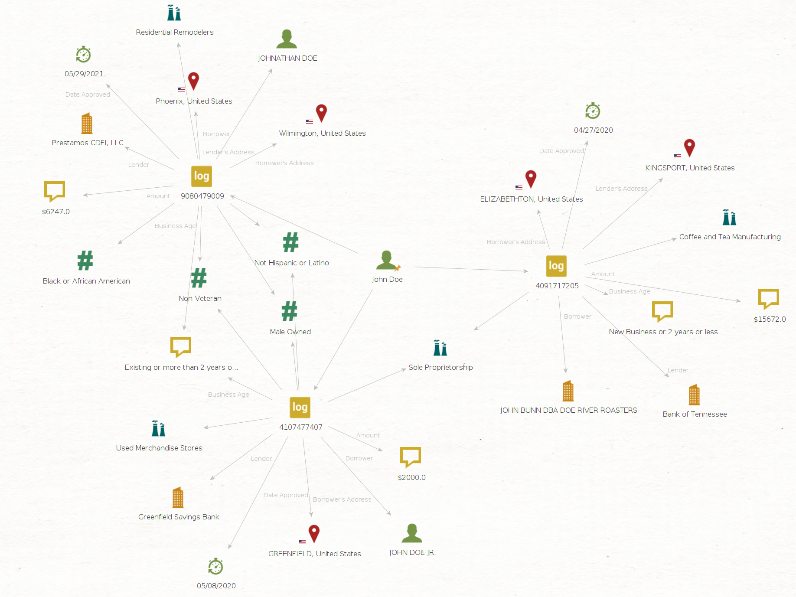

### Maltego Transforms for Public Small Business Association Data


Version: 1.0.0-beta

## 💎 About

Search Small Business Association Data (SBA) using Maltego Transforms. SBA provides millions of public records which may be useful for OSINT investigations. SBA-Maltego harnesses these datasets by creating a local SQLite database copy of the SBA data for ease of searching and then converting the data into Maltego Transforms upon request.

Please use this tool ethically by respecting people's privacy and only collecting intelligence where explicit permission has been granted or otherwise legally qualified to do so. We are not responsible for any illegal use.

## 🛠️ Setup

### Requirements
- Maltego 4.3.0
- [Python 3.11.2](./requirements.txt)
   
### Installation
```
   git clone https://github.com/kodamaChameleon/sba-maltego.git
   cd sba-maltego
   python3 setup.py
```

🚨 **Huge File Alert!** The datasets can be quite large. For the current [supported packages](https://github.com/kodamaChameleon/sba-maltego/blob/main/supported_packages.json), a minimum of ```5.0 Gb``` is required for the SBA_local.db alone.
   
## 🧙 Features

Will the real "John Doe" please stand up 🤔



| Name                         | Description                                     | Input Type               | Notes                          |
|------------------------------|-------------------------------------------------|--------------------------|--------------------------------|
| PPPLoan_fromBorrowingCompany | Returns loan number from company by borrower    | maltego.Company          |                                |
| PPPLoan_fromBorrowingPerson  | Returns loan number from name by borrower       | maltego.Person           |                                |
| PPPLoan_toDetails            | Extrapolate details of PPP loanaddresses        | maltego.UniqueIdentifier |                                |
   
## 📜 License


[Creative Commons Attribution-ShareAlike 4.0 International License](https://creativecommons.org/licenses/by-sa/4.0/)  
Copyright (C) 2023 KodamaChameleon
